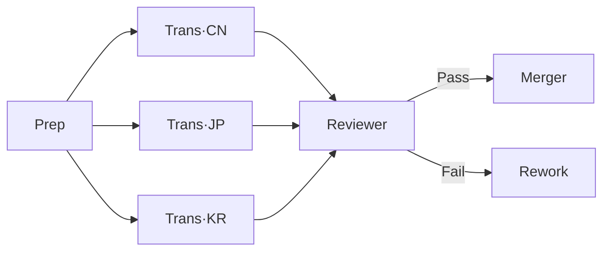

# Daoist Talismans ── Claude Code Agent Prompt Generator

[](LICENSE)
[](https://claude.com/claude-code)
[](README.md)

> [中文](README.md)

Generate agent prompts for Claude Code using the metaphor of Daoist ritual arts.

A Daoist priest draws talismans to command celestial soldiers; a developer writes prompts to drive agents.

---

## 30-Second Quick Start

```bash
# 1. Install
git clone https://github.com/ChiShengChen/dao-agent.git
cd dao-agent
bash install.sh --lang en

# 2. In Claude Code, just say
> Decree a Builder general to add CRUD endpoints for /src/api/users
```

That's it. The skill auto-generates a structured agent prompt with role, steps, constraints, and output spec.

---

## Comparison with Shikigami

Both are East-Asian mythology-themed Claude Code Skills. Here's a feature comparison:

| Feature | Daoist Talismans (dao-agent) | [Shikigami](https://github.com/ChiShengChen/shikigami) |
|---------|:---:|:---:|
| Agent Templates | 6 types | 6 types |
| Multi-Agent Rituals | 6 base + 3 advanced | 5 types |
| Ready-made Library | 7 prompts | — |
| Prompt Linting | 15 rules | — |
| Token Estimation | Formulas + cheat sheet | 4-tier power system |
| Diagnosis Mode | Interactive recommendation | — |
| Workflow Diagrams | ASCII + Mermaid | Mermaid |
| Constraint System | 3-layer + exemptions + reports | 8 rules + exemptions |
| Enhancement Modules | 6 spells + compatibility matrix | 6 spells + incompatibility flags |
| Audit / Scoring | 5-dimension + monthly dashboard | Invocation log |
| Dry Run Simulator | Full + partial | — |
| Post-mortem | Auto ceremony record | — |
| Template Inheritance | Parent/child, 3 levels | — |
| MCP Integration Guide | 6 tool categories | — |
| Agent SDK Templates | Python + TypeScript | — |
| Hooks Integration | 4 configurations | — |
| Bilingual | ✅ | ✅ |

Both projects complement each other — pick the cultural flavor you prefer.

---

## Features

### Core Generation

<details>
<summary><b>6 Talisman Templates</b> ── Solo Agent, Scout, Builder, Reviewer, Orchestrator, Guardian</summary>

Each agent type has a structured prompt template — fill in the parameters and decree.

```
You are a Builder master skilled in TypeScript.

Mission: Add CRUD endpoints for /src/api/users.

Ritual:
1. Read existing API structure, understand routing conventions
2. Create route handler at /src/api/users/
3. Write corresponding integration tests
4. Run pnpm test to confirm all pass

Seals:
- Do not modify other modules under /src/api/
- All input must be validated

Merit Ledger:
- New file list + API docs + test results
```
</details>

<details>
<summary><b>6 Base Rituals</b> ── Pipeline, Fan-out, Iterative Refinement, Gatekeeper, Expert Panel, Layered Architecture</summary>

Classic multi-agent workflow formations with Orchestrator decree snippets.

```
Pipeline (Stepping the Stars) example:

[Scout·Recon] → [Builder·Code] → [Reviewer·Audit] → [Deployer·Ship]

Orchestrator decree:
1. Decree Scout to scan /src, output to /tmp/pipeline/step1/
2. Decree Builder, take step1 as input, output to /tmp/pipeline/step2/
3. Decree Reviewer to audit step2, report to /tmp/pipeline/step3/
4. If Reviewer finds no critical issues, decree Deployer to ship step2
```
</details>

<details>
<summary><b>Advanced Rituals</b> ── Nested Workflows, Human-in-the-Loop, Fallback Agent</summary>

```
Nested: Pipeline with embedded Iterative Refinement loop

[Scout] → 【Nine-Turn Elixir: Builder ↔ Reviewer, max 3 turns】→ [Deployer]

Human-in-the-Loop: Pause for user confirmation on high-risk ops

[Builder] → ⏸️ User: "Deploy to production?" → [Deployer]

Fallback: Auto-degrade when primary fails

[AST Analyzer] → fail → [Regex Search Agent] → fail → [Report Agent·hand to user]
```
</details>

### Efficiency Tools

<details>
<summary><b>Prompt Library</b> ── 7 ready-made prompts, pick one and fill in params</summary>

No need to write from scratch. Common tasks have templates:

| Agent | Purpose | One-liner Example |
|-------|---------|-------------------|
| Refactor Master | Code refactoring | "Split /src/utils.ts (800 lines) into single-responsibility modules" |
| Trial Officer | Test generation | "Write tests for /src/api/auth.ts, target 80% coverage" |
| Translator Sage | Doc translation | "Translate /docs/*.md from English to Traditional Chinese" |
| Mountain Mover | DB migration | "Add email_verified boolean column to users table" |
| Gate Opener | API endpoints | "Add POST /api/cart/items" |
| Celestial Engineer | CI/CD repair | "GitHub Actions build step is timing out, investigate" |
| Demon Subduer | Security scan | "Scan Python code under /src for security vulnerabilities" |
</details>

<details>
<summary><b>Prompt Linting</b> ── 15 auto-checks, runs after every talisman generation</summary>

Generated prompts are automatically linted across 3 severity levels:

```
Lint results example:

🔴 Critical #5: Vague instruction — "process relevant files" → change to "process /src/**/*.ts"
🟡 Warning #6: No error handling → add "on API timeout, retry 3x then skip"
🔵 Info #12: Not imperative — "you should read" → change to "read"

Verdict: ⚠️ Deploy with caution (fix critical items first)
```
</details>

<details>
<summary><b>Token Estimation</b> ── Budget formulas + quick-reference chant</summary>

```
Quick estimate example:

Q: 3 agents, medium task, Nine-Turn Elixir with max 3 turns?
A: Base 10K × Agent multiplier 2.5 × Iteration multiplier 2.5 = 62.5K tokens

Chant:
A talisman starts at three hundred, eight hundred is the ceiling.
One agent starts at two thousand, a hundred thousand for grand works.
Parallel saves no power, only saves marching time.
Iteration doubles the count, three rounds multiply by three.
Match model to cultivation — don't use an ox to kill a chicken.
```
</details>

<details>
<summary><b>Diagnosis Mode</b> ── Not sure what to use? Answer a few questions, get a recommendation</summary>

```
User: "I want to translate an API doc into 5 languages, with quality review after."

Diagnosis inference:
- 5 parallel translations → Fan-out / Fan-in
- Quality review needed → add Reviewer
- No production risk → no checkpoints needed

Diagnosis Summary:
- Recommended Ritual: Five Thunders + Gate Guardian (validate out)
- General Roster: 1 Prep + 5 Translators + 1 Reviewer + 1 Merger
- Estimated Budget: ~40K tokens
- Suggested Form: Grand Ceremony

Proceed with this plan?
```
</details>

<details>
<summary><b>Workflow Diagrams</b> ── ASCII / Mermaid topology, see altar relationships at a glance</summary>

Auto-generated for multi-agent rituals:

```
ASCII:
                      ┌──→ [Translator·CN] ──→┐
[Prep Agent] ────→    ├──→ [Translator·JP] ──→┤  ──→ [Reviewer] ──→ [Merger]
                      └──→ [Translator·KR] ──→┘
```


</details>

### External Integration

<details>
<summary><b>MCP Integration</b> ── Use Slack, GitHub, DB and other MCP servers in talismans</summary>

```
MCP tools in a talisman:

Tool Inventory:
- MCP Tools:
  - github: list_pull_requests, get_pull_request
  - slack: send_message (only #code-review channel)
  - postgres: query (SELECT only)
- Forbidden:
  - slack: all channels except #code-review
  - postgres: any write operations
```
</details>

<details>
<summary><b>Agent SDK Rituals</b> ── Python / TypeScript programmatic orchestration</summary>

```python
# Python SDK Pipeline example
scout_result = await Claude.create(
    prompt=scout_talisman,
    options=ClaudeOptions(max_turns=5, model="claude-sonnet-4-6")
)
builder_result = await Claude.create(
    prompt=f"{builder_talisman}\n\nInput:\n{scout_result}",
    options=ClaudeOptions(max_turns=10, model="claude-sonnet-4-6")
)
```

```typescript
// TypeScript SDK Iterative Refinement example
for (let turn = 1; turn <= MAX_TURNS; turn++) {
  artifact = await Claude.create({ prompt: `${builderTalisman}\nPrevious report: ${feedback}` });
  const review = await Claude.create({ prompt: `${reviewerTalisman}\nArtifact: ${artifact}` });
  if (review.includes("Pass")) break;
  feedback = review;
}
```
</details>

<details>
<summary><b>Hooks Integration</b> ── Auto-test, constraint enforcement, completion notification</summary>

```json
// Auto-run tests after every code edit
{
  "hooks": {
    "PostToolUse": [{
      "matcher": "Write|Edit",
      "command": "echo \"$CLAUDE_FILE_PATH\" | grep -qE '\\.(py|js|ts)$' && npm test 2>&1 | tail -5 || true"
    }]
  }
}

// Block writes to forbidden zones
{
  "hooks": {
    "PreToolUse": [{
      "matcher": "Write|Edit",
      "command": "echo \"$CLAUDE_FILE_PATH\" | grep -qE '^/prod/' && echo 'BLOCK: Forbidden' && exit 1 || exit 0"
    }]
  }
}
```
</details>

### Governance & Quality

<details>
<summary><b>Commandment System</b> ── 3-layer constraints governing all agents</summary>

```
Three layers:

Universal (all agents) ── 8 rules
  UC-001 No secret leakage (.env, API keys)         🔴 Unpardonable
  UC-003 No fabrication (don't invent data)          🔴 Critical
  UC-008 No self-modification (don't edit own prompt) 🔴 Unpardonable

Role-specific ── per agent type
  Reviewer RC-002: Audit only, do not modify
  Builder RC-003: All creations must include tests

Ceremony-specific ── temporary
  CC-001: Do not touch /src/legacy/ in this ceremony

Exemptions: Priest can exempt specific rules (UC-001, UC-008 are never exemptible)
```
</details>

<details>
<summary><b>Enhancement Modules</b> ── 6 composable spells + compatibility matrix</summary>

```
Six enhancement spells:

Self-Reflection ── auto-verify after completion (format→completeness→quality, max 3 rounds)
Progress Report ── [REPORT] Stage 3/5 | Builder | ✅ Complete | 12s
Meditation      ── deliberate in <thinking> before critical decisions
Sandbox         ── Allow write /src/**, deny /.env*, /node_modules/**
Strict Mode     ── halt on any error, package full context for user
Verbose Log     ── [LOG] WRITE /src/api.ts (342 bytes, +15/-3 lines)

Synergy:  Sandbox + Strict Mode (boundary violation = immediate halt)
Conflict: Strict Mode + Verbose Log (⚠️ verbose output may trigger "unexpected output" check)
Limit:    recommend max 3 stacked
```
</details>

<details>
<summary><b>Merit & Demerit Record</b> ── Invocation audit + 5-dimension scoring + monthly dashboard</summary>

```
Performance scoring example:

| Dimension | Score | Notes |
|-----------|-------|-------|
| Mission Completion | 95/100 | All endpoints built and functional |
| Token Efficiency | 80/100 | Estimated 10K, actual 13K (30% over) |
| Quality | 90/100 | Format correct, test coverage 85% |
| Compliance | 100/100 | No violations |
| Error Handling | 85/100 | Graceful fallback to cache on API timeout |

Weighted Total: 91 / 100
Grade: S ── Exemplary performance
```
</details>

<details>
<summary><b>Ritual Simulator</b> ── Dry run with mock data before the real ceremony</summary>

```
⚙️ Rehearsal Mode Active

Altar: /tmp/rehearsal/translate-pipeline/
Input: 3 mock files (normal.md, edge.md, error.md)
Rules: no real API calls, no remote push, merit ledger prefixed [REHEARSAL]

Rehearsal Debrief:
| # | Position | Agent | Result | Notes |
| 1 | Prep | ✅ | |
| 2 | Trans·CN | ✅ | |
| 3 | Trans·JP | ⚠️ | Output missing summary field |
| 4 | Merger | ❌ | Position 3 format mismatch broke parser |

Verdict: ⚠️ Fix Position 3 merit ledger format, then ready for production
Estimated real tokens: ~35K
```
</details>

<details>
<summary><b>Ceremony Record</b> ── Auto-generated post-mortem after complex rituals</summary>

```
Ceremony Record: Shopping Cart API Development

Mission Completion: 90% (4/4 endpoints done, but DELETE missing soft-delete)

Lessons Learned:
Merit: Scout output was well-formatted, Builder needed no extra parsing
Demerit: Data format between Pos 2→3 wasn't aligned, Reviewer spent extra time

Talisman Improvements:
| Agent | Suggestion |
| Builder | Merit ledger should include response schema |
| Reviewer | Add soft-delete check to audit standards |

Action Items:
- [ ] Update Builder talisman merit ledger spec
- [ ] Add CC-004 to parent: DELETE endpoints must support soft-delete
```
</details>

<details>
<summary><b>Template Inheritance</b> ── Parent/child system, reduce duplication</summary>

```
Parent Talisman: E-commerce Project
├── Altar: /workspace/ecommerce (TypeScript + Next.js + Prisma)
├── Commandments: UC-001, UC-002, UC-003 + "don't modify existing migrations"
├── Style: camelCase, 2 spaces, Result<T,Error> pattern
├── Sandbox: allow write /src/**, deny .env* and node_modules/
└── Enhancements: Self-Reflection + Progress Report

Child Talisman: Shopping Cart Builder
├── Inherits: E-commerce Project ← auto-inherits all settings above
├── Mission: Implement POST /api/cart/items
├── Additional Constraint: CC-004 cart logic must have unit tests
├── Sandbox Extension: allow write prisma/schema.prisma
└── Agent-specific Ritual: [steps unique to this agent]

Result: child talisman is 15 lines of diffs, not 50 lines of repeated config
```
</details>

## Installation

```bash
# Default install (Chinese)
bash install.sh

# Choose language
bash install.sh --lang zh   # Chinese
bash install.sh --lang en   # English
```

The install script copies the skill files for the selected language into `~/.claude/skills/`.

## Manual Installation

Copy all files from the desired language folder to your Claude Code skills directory:

```bash
# Chinese
cp zh/*.md ~/.claude/skills/daoist-agent/

# English
cp en/*.md ~/.claude/skills/daoist-agent/
```

## Usage

After installation, in Claude Code:

```
# Describe what you need
> Decree a spirit general to refactor the code under /src/api

# Use Daoist terminology
> Open the altar, summon three generals, use the Five Thunders ritual to translate into three languages in parallel

# Or just say it plainly
> Write me an agent prompt for Claude Code to do code review
```

## File Structure

```
files_dao/
├── README.md                  ← Chinese README (default)
├── README.en.md               ← English README (this file)
├── install.sh                 ← Install script (language selection)
├── zh/                        ← Chinese version
│   └── ...
├── en/                        ← English version
│   └── ...
└── daoist-agent.skill         ← Packaged skill
```

## License

MIT
