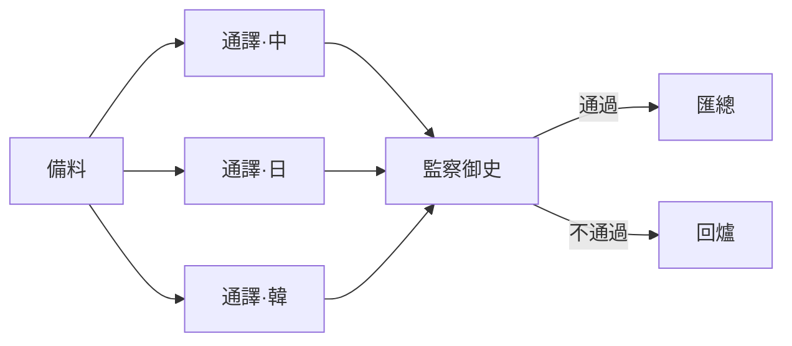

# 道法符籙 ── Claude Code Agent Prompt Generator

[](LICENSE)
[](https://claude.com/claude-code)
[](README.en.md)

> [English](README.en.md)

以道教科儀之法，為 Claude Code 生成 agent prompt。

道士書符以敕令天兵；開發者撰 prompt 以驅動 agent。

---

## 30 秒快速開始

```bash
# 1. 安裝
git clone https://github.com/ChiShengChen/dao-agent.git
cd dao-agent
bash install.sh

# 2. 在 Claude Code 中直接說
> 幫我敕令一位造化真人，為 /src/api/users 新增 CRUD endpoints
```

就這樣。Skill 會自動生成結構化的 agent prompt，包含角色、步驟、禁制、輸出規格。

---

## 與 Shikigami 功能對照

同為東方神話主題的 Claude Code Skill，以下是功能對比：

| 功能 | 道法符籙 (dao-agent) | [式神 (shikigami)](https://github.com/ChiShengChen/shikigami) |
|------|:---:|:---:|
| Agent 模板 | 6 種 | 6 種 |
| 多 Agent 科儀 | 6 基礎 + 3 進階 | 5 種 |
| 現成符籙庫 | 7 道 | — |
| Prompt Linting | 15 條規則 | — |
| Token 估算 | 公式 + 口訣 | 4 級法力分類 |
| 問診模式 | 互動推薦 | — |
| 科儀圖譜 | ASCII + Mermaid | Mermaid |
| 戒律系統 | 3 層 + 豁免 + 奏摺 | 8 條 + 豁免 |
| 加持模組 | 6 道 + 相剋表 | 6 道 + 不相容標記 |
| 審計/考核 | 5 維度 + 月報 | 召喚記錄 |
| Dry Run 模擬 | 完整 + 局部 | — |
| Post-mortem | 自動法會錄 | — |
| 符籙繼承 | 母符/子符 3 層 | — |
| MCP 整合指引 | 6 類法器 | — |
| Agent SDK 模板 | Python + TS | — |
| Hooks 連動 | 4 種配置 | — |
| 中英雙語 | ✅ | ✅ |

兩者可互補參考，選擇你喜歡的文化風味。

---

## 功能一覽

### 符籙生成核心

<details>
<summary><b>六大符籙模板</b> ── 獨行道兵、千里眼、造化真人、監察御史、都天大法主、護法天王</summary>

每種神將對應一套結構化 prompt 模板，填入參數即可敕令。

```
你是一位精通 TypeScript 的造化真人。

天命：為 /src/api/users 新增 CRUD endpoints。

科儀：
1. 讀取現有 API 結構，理解路由慣例
2. 在 /src/api/users/ 新增 route handler
3. 撰寫對應的整合測試
4. 執行 pnpm test 確認通過

禁制：
- 不得修改 /src/api/ 下其他模組
- 所有輸入必須驗證

功德簿：
- 新增檔案清冊 + API 文件 + 測試結果
```
</details>

<details>
<summary><b>六大基礎科儀</b> ── Pipeline、Fan-out、迭代精煉、守關法、三清會議、三才陣</summary>

多 agent 工作流的經典陣式，附帶 Orchestrator 敕令片段。

```
步罡踏斗（Pipeline）範例：

[千里眼·探查需求] → [造化真人·寫程式碼] → [監察御史·Code Review] → [部署道兵·上線]

大法主敕令片段：
1. 敕令千里眼掃描 /src，功德存 /tmp/pipeline/step1/
2. 敕令造化真人取 step1 為供物，功德存 /tmp/pipeline/step2/
3. 敕令監察御史審查 step2，奏摺存 /tmp/pipeline/step3/
4. 若御史判定無天劫，敕令部署道兵取 step2 部署
```
</details>

<details>
<summary><b>進階科儀</b> ── 巢狀科儀、輪值道兵(Human-in-the-Loop)、替身道兵(Fallback)</summary>

```
巢狀科儀：Pipeline 中嵌入九轉金丹迴圈

[千里眼] → 【九轉金丹：造化真人 ↔ 監察御史，最多 3 轉】→ [部署道兵]

輪值道兵：高風險操作暫停等法師確認

[造化真人] → ⏸️ 法師確認「要部署到 production 嗎？」→ [部署道兵]

替身道兵：主將失敗自動降級

[AST 分析真人] → 失敗 → [正則搜索道兵] → 失敗 → [呈報道兵·交給法師]
```
</details>

### 效率工具

<details>
<summary><b>符籙庫</b> ── 7 道現成符籙，選一道填參數直接用</summary>

不必從頭書符。常見任務有現成模板：

| 法號 | 用途 | 一句話範例 |
|------|------|-----------|
| 重構真人 | 程式碼重構 | 「把 /src/utils.ts 的 800 行拆成單職責模組」 |
| 試煉仙官 | 測試生成 | 「為 /src/api/auth.ts 補寫測試，目標覆蓋率 80%」 |
| 通譯仙人 | 文件翻譯 | 「把 /docs 下的 .md 從英文翻成繁體中文」 |
| 移山真人 | DB 遷移 | 「users 表加 email_verified boolean 欄位」 |
| 開門真人 | API 端點 | 「新增 POST /api/cart/items」 |
| 天機真人 | CI/CD 修繕 | 「GitHub Actions 的 build step 超時，幫我查」 |
| 降魔護法 | 安全掃描 | 「掃描 /src 下的 Python 程式碼找安全漏洞」 |
</details>

<details>
<summary><b>符籙驗證</b> ── 15 條自動檢查，書符後自動過堂</summary>

生成的 prompt 自動被 lint，三級分類：

```
驗證結果範例：

🔴 天劫 #5：含糊指令 ──「處理相關檔案」→ 應改為「處理 /src/**/*.ts」
🟡 地劫 #6：缺渡劫之策 → 加入「遇 API 超時，重試 3 次後跳過」
🔵 人劫 #12：非祈使語氣 →「你應該讀取」改為「讀取」

判定：⚠️ 帶傷出壇（天劫修正後可用）
```
</details>

<details>
<summary><b>法力估算</b> ── Token 預算公式 + 口訣速記</summary>

```
快速估算範例：

Q: 3 位神將做中等任務，用九轉金丹最多 3 轉？
A: 基礎法力 10K × 神將倍率 2.5 × 迭代倍率 2.5 = 62.5K tokens

口訣：
一符三百起，八百為上限。
一兵兩千始，十萬為大業。
並行不省力，只省趕路時。
迭代翻倍算，三轉乘以三。
模型看道行，殺雞莫用牛。
```
</details>

<details>
<summary><b>問診模式</b> ── 不確定用什麼？回答幾個問題自動推薦</summary>

```
法師：「我想把一份 API 文件翻成五國語言，翻完要有人檢查品質。」

問診推斷：
- 五路並行翻譯 → 五雷正法
- 翻完要檢查 → 加監察御史
- 不涉及生產環境 → 無需輪值

📋 問診結論：
- 推薦科儀：五雷正法 + 守關法（驗出）
- 神將編制：1 備料 + 5 通譯仙人 + 1 監察御史 + 1 匯總真人
- 預估法力：~40K tokens
- 建議形制：大醮科儀

是否按此方案開壇書符？
```
</details>

<details>
<summary><b>科儀圖譜</b> ── ASCII / Mermaid 拓撲圖，一眼看清壇位關係</summary>

自動為多 agent 科儀生成拓撲圖：

```
ASCII：
                    ┌──→ [通譯仙·中文] ──→┐
[備料道兵] ────→   ├──→ [通譯仙·日文] ──→┤  ──→ [監察御史] ──→ [匯總真人]
                    └──→ [通譯仙·韓文] ──→┘
```


</details>

### 外部整合

<details>
<summary><b>MCP 法器對接</b> ── 在符籙中使用 Slack、GitHub、DB 等 MCP server</summary>

```
符籙中的 MCP 法器寫法：

法器清單：
- MCP 法器：
  - github: list_pull_requests, get_pull_request
  - slack: send_message（僅限 #code-review 頻道）
  - postgres: query（僅限 SELECT）
- 不可觸碰：
  - slack: 除 #code-review 外的所有頻道
  - postgres: 任何寫入操作
```
</details>

<details>
<summary><b>Agent SDK 科儀</b> ── Python / TypeScript 程式化編排模板</summary>

```python
# Python SDK 步罡踏斗範例
scout_result = await Claude.create(
    prompt=scout_talisman,
    options=ClaudeOptions(max_turns=5, model="claude-sonnet-4-6")
)
builder_result = await Claude.create(
    prompt=f"{builder_talisman}\n\n供物：\n{scout_result}",
    options=ClaudeOptions(max_turns=10, model="claude-sonnet-4-6")
)
```

```typescript
// TypeScript SDK 九轉金丹範例
for (let turn = 1; turn <= MAX_TURNS; turn++) {
  artifact = await Claude.create({ prompt: `${builderTalisman}\n前次奏摺：${feedback}` });
  const review = await Claude.create({ prompt: `${reviewerTalisman}\n丹藥：${artifact}` });
  if (review.includes("Pass")) break;
  feedback = review;
}
```
</details>

<details>
<summary><b>Hooks 連動</b> ── 自動試煉、禁制守護、收壇通報</summary>

```json
// 每次編輯程式碼後自動跑測試
{
  "hooks": {
    "PostToolUse": [{
      "matcher": "Write|Edit",
      "command": "echo \"$CLAUDE_FILE_PATH\" | grep -qE '\\.(py|js|ts)$' && npm test 2>&1 | tail -5 || true"
    }]
  }
}

// 攔截對禁區的寫入
{
  "hooks": {
    "PreToolUse": [{
      "matcher": "Write|Edit",
      "command": "echo \"$CLAUDE_FILE_PATH\" | grep -qE '^/prod/' && echo 'BLOCK: 禁地' && exit 1 || exit 0"
    }]
  }
}
```
</details>

### 治理與品質

<details>
<summary><b>天條戒律</b> ── 三層戒律體系，統一約束所有道兵</summary>

```
三層架構：

天條（Universal）── 8 條，所有道兵共守
  TC-001 不得洩露天機（.env、API key）      🔴 不赦
  TC-003 不得無中生有（不可編造資訊）        🔴 天劫
  TC-008 不得自改符籙（不可修改自身 prompt） 🔴 不赦

職律（Role-specific）── 依角色而定
  監察御史 RC-002：只審不改
  造化真人 RC-003：造物必附試煉

壇律（Ceremony-specific）── 臨時戒律
  CS-001：本次不得觸碰 /src/legacy/

豁免令：法師可豁免特定戒律（TC-001、TC-008 永不可赦）
```
</details>

<details>
<summary><b>加持符系統</b> ── 6 道加持 + 相生相剋表</summary>

```
六道加持符：

自省訣 ── 完成後自動驗證功德（格式→完整性→品質，最多 3 輪）
通報訣 ── [法報] 第 3/5 壇 | 造化真人 | ✅ 圓滿 | 耗時 12s
靜心訣 ── 關鍵決策前在 <thinking> 中推演利弊再行動
結界符 ── 允許寫入 /src/**，禁止存取 /.env*、/node_modules/**
金剛戒 ── 遇任何錯誤立即停止，打包現場呈報法師
天眼通 ── [天眼] WRITE /src/api.ts (342 bytes, +15/-3 lines)

相生：結界符 + 金剛戒（越界即停，雙重保護）
相剋：金剛戒 + 天眼通（⚠️ 大量日誌可能觸發「非預期輸出」）
上限：建議最多疊 3 道
```
</details>

<details>
<summary><b>功過格</b> ── 召喚記錄 + 五維度考核 + 月報</summary>

```
功過考核範例：

| 維度 | 得分 | 說明 |
|------|------|------|
| 天命達成 | 95/100 | 所有端點已建立且可用 |
| 法力效率 | 80/100 | 預估 10K，實耗 13K（超支 30%）|
| 品質 | 90/100 | 功德簿格式正確，測試覆蓋 85% |
| 戒律遵守 | 100/100 | 無違規 |
| 渡劫能力 | 85/100 | API 超時時優雅降級為快取 |

加權總分：91 / 100
等第：上上 ── 功德圓滿，堪為表率
```
</details>

<details>
<summary><b>演法壇</b> ── Mock 乾跑，正式開壇前先預演</summary>

```
⚙️ 演法模式啟動

壇場：/tmp/rehearsal/translate-pipeline/
供物：3 個 mock 檔案（normal.md、edge.md、error.md）
規則：不呼叫真實 API、不推送遠端、功德簿加 [演法] 前綴

演法覆盤：
| 壇位 | 道兵 | 結果 | 備註 |
| 1 | 備料 | ✅ | |
| 2 | 翻譯·中 | ✅ | |
| 3 | 翻譯·日 | ⚠️ | 輸出缺 summary 欄位 |
| 4 | 匯總 | ❌ | 壇位 3 格式不符導致解析失敗 |

結論：⚠️ 修正壇位 3 的功德簿格式後可正式開壇
推估正式法力：~35K tokens
```
</details>

<details>
<summary><b>法會錄</b> ── 科儀結束後自動生成 post-mortem</summary>

```
法會錄：購物車 API 開發科儀

天命達成率：90%（4/4 端點完成，但 DELETE 缺少軟刪除）

經驗提煉：
功：千里眼的探查格式化良好，造化真人無需額外解析
過：壇位 2→3 法物格式未統一，御史花了額外時間

符籙改善建議：
| 道兵 | 建議 |
| 造化真人 | 功德簿需包含 response schema |
| 監察御史 | 加入 soft-delete 檢查項 |

行動項目：
- [ ] 更新造化真人符籙的功德簿規格
- [ ] 在母符中追加 CS-004：DELETE 端點必須支援軟刪除
```
</details>

<details>
<summary><b>傳承譜系</b> ── 母符/子符繼承，減少重複</summary>

```
母符：電商專案
├── 壇場：/workspace/ecommerce（TypeScript + Next.js + Prisma）
├── 門規：TC-001, TC-002, TC-003 + 壇律「不得直接改 migration」
├── 門風：camelCase、2 spaces、Result<T,Error> pattern
├── 結界：允許寫入 /src/**、禁止 .env* 和 node_modules/
└── 加持：自省訣 + 通報訣

子符：購物車造化真人
├── 承自：電商專案 ← 自動繼承上述所有設定
├── 天命：實作 POST /api/cart/items
├── 追加壇律：CS-004 購物車邏輯須有 unit test
├── 追加結界：允許寫入 prisma/schema.prisma
└── 專屬科儀：[此道兵獨有的步驟]

效果：子符只寫 15 行差異，而非重複 50 行共用設定
```
</details>

## 安裝

```bash
# 預設安裝（中文）
bash install.sh

# 選擇語言安裝
bash install.sh --lang zh   # 中文
bash install.sh --lang en   # English
```

安裝腳本會將對應語言的 skill 檔案複製到 `~/.claude/skills/` 目錄。

## 手動安裝

若不使用安裝腳本，將對應語言資料夾中的所有檔案複製到你的 Claude Code skills 目錄：

```bash
# 中文
cp zh/*.md ~/.claude/skills/daoist-agent/

# English
cp en/*.md ~/.claude/skills/daoist-agent/
```

## 使用方式

安裝後，在 Claude Code 中：

```
# 直接描述需求
> 幫我敕令一位道兵去重構 /src/api 下的程式碼

# 使用道教術語
> 開壇，召三位神將，以五雷正法並行翻譯三國語言

# 簡單說
> 幫我寫一個 agent prompt 讓 Claude Code 去做 code review
```

## 檔案結構

```
files_dao/
├── README.md                  ← 中文說明（本檔）
├── README.en.md               ← English README
├── install.sh                 ← 安裝腳本（支援語言選擇）
├── zh/                        ← 中文版（14 檔）
│   ├── SKILL.md               ← Skill 主檔
│   ├── talismans.md           ← 六大符籙模板
│   ├── rituals.md             ← 六大基礎科儀
│   ├── library.md             ← 符籙庫（現成符）
│   ├── linting.md             ← 符籙驗證規則
│   ├── advanced-rituals.md    ← 進階科儀
│   ├── integrations.md        ← 法器對接
│   ├── estimation.md          ← 法力估算
│   ├── commandments.md        ← 天條戒律
│   ├── enhancements.md        ← 加持符系統 + 相生相剋表
│   ├── merit-record.md        ← 功過格
│   ├── simulator.md           ← 演法壇
│   ├── postmortem.md          ← 法會錄
│   └── inheritance.md         ← 傳承譜系
├── en/                        ← English version（14 檔）
│   └── (same structure)
└── daoist-agent.skill         ← 打包檔
```

## 授權

MIT
