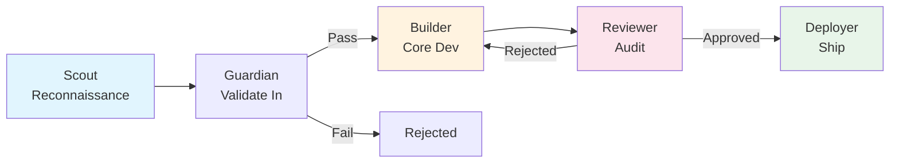

# Daoist Talismans ── Claude Code Agent Prompt Generator

> A Daoist priest draws talismans to command celestial soldiers; a developer writes prompts to drive agents.
> One talisman, one decree, all methods converge.

## Terminology Mapping

Daoism teaches "The Dao gives birth to One, One gives birth to Two, Two gives birth to Three, Three gives birth to all things." Agent systems follow the same principle — from one requirement comes architecture, from architecture comes division of labor, from division comes execution at scale. This skill maps Daoist ritual arts onto agent development:

| Daoist Concept | Technical Term | Description |
|---------------|----------------|-------------|
| Spirit General (道兵/神將) | Agent | A Claude Code instance given a mission by talisman decree |
| High Priest (法師/高功) | Orchestrator / User | The one who presides over rituals and commands the generals |
| Decree / Summon (敕令/召將) | Spawn / Create | Activating a general with a talisman incantation |
| Talisman (符籙) | System Prompt / Instructions | The core text with commands and directives — an agent's behavioral contract |
| Seal / Constraint (禁制) | Scope & Constraints | Commandments that seal the boundaries of an agent's power |
| Spiritual Power (法力) | Token Budget / Resources | Computational resources available, like a cultivator's inner energy |
| Ritual / Ceremony (科儀/醮典) | Workflow / Pipeline | A complete ceremony where multiple generals act in sequence |
| Dharma Name (法號) | Agent ID / Role Name | The general's title and designated duty |
| Altar (壇場) | Working Directory | The workspace where an agent operates, each altar isolated |
| Artifact (法器) | Tools | Bash commands, APIs, file operations available to the agent |
| Merit Ledger (功德簿) | Output / Log | Results and records reported after task completion |
| Tribulation (天劫) | Error / Failure | Exceptions and failures encountered during execution |
| Crossing Tribulation (渡劫) | Error Handling | Strategies for dealing with tribulations |

## When to Open the Altar

- User wants to write an agent prompt for Claude Code
- User wants to design a multi-agent workflow
- User wants to generate a CLAUDE.md file
- User wants to decompose a complex task into multiple sub-agents
- User says "decree", "summon", "open altar", "draw talisman" or any agent-related request

## Opening the Altar ── Talisman Generation Flow

### Step 1: Name the General, Define the Mission

Before drawing any talisman, know the name and duty. Before generating a prompt, confirm (if already stated in conversation, extract directly):

1. **Dharma Name** (Role): What is this general's title? What duty do they hold?
2. **Heavenly Mission** (Mission): What specific task must they accomplish?
3. **Seals** (Constraints): What is forbidden? What tools may be used?
4. **Offerings / Dedication** (I/O): What input is received? What output is produced?
5. **Altar Position** (Workflow Position): Solo ritual or part of a grand ceremony with other generals?
6. **Cultivation Level** (Complexity): How much autonomous judgment is needed?

If the user has already stated their requirements clearly, do not ask repeatedly — proceed directly to drawing the talisman.

### Step 2: Select Talisman Template

Choose the talisman structure based on agent type. Read `talismans.md` for complete templates.

Six Great Generals:

- **Solo Agent** (獨行道兵): Acts alone, one talisman completes the job
- **Scout** (千里眼): Vanguard specialist in reconnaissance, search, and intelligence gathering
- **Builder** (造化真人): Responsible for creation — writing code, generating files, building systems
- **Reviewer** (監察御史): Impartial judge for review, testing, quality assurance
- **Orchestrator** (都天大法主): Commands from the central altar, dispatches generals, never acts directly
- **Guardian** (護法天王): Defends the altar, monitors anomalies, guards boundaries

### Step 3: Draw the Talisman (Generate Prompt)

The art of talisman drawing demands "every word has spirit, every sentence has power." Generated prompts must follow these principles:

#### Talisman Structure — Six Lines Format

Drawn from the I Ching's six-line hexagram theory, each talisman has six layers:

1. **Line 1: Declare name, state mission** — One opening sentence clarifying role and goal
2. **Line 2: List tools, define authority** — Enumerate available bash commands, file operations, APIs
3. **Line 3: Lay out ritual, define steps** — Use numbered steps or decision trees for the procedure
4. **Line 4: Define output, specify merit** — Precisely define output format and storage location
5. **Line 5: Set tribulation handling** — Strategies for dealing with errors
6. **Line 6: Judge completion** — What conditions constitute success

#### Talisman Writing Principles

- **Use decree voice** (imperative): "Read the file" not "You should read the file" — talismans are commands, not suggestions
- **Be specific over vague**: "Find all .py files under /src" not "find relevant files" — incantations must never be ambiguous
- **Constraints over enablement**: Writing "Do not modify files under /config" is ten times more effective than "Handle config files carefully"
- **Examples are the best scripture**: Include input/output examples, like illustrated incantation guides
- **Moderate length**: Keep prompts at 300–800 tokens — too short is a broken talisman without power, too long is a chaotic spell that backfires

#### Three Talisman Forms

**Form A: Altar Ward Format** (for project-level CLAUDE.md)
```markdown
# Altar Configuration

## Dharma Name
[Role definition]

## Decree
[Core instructions]

## Ritual
[Workflow]

## Seals
[Constraints]

## Merit Ledger
[Output specification]
```

**Form B: Flying Talisman Format** (for `claude -p` one-shot calls)
Generate a prompt string that can be pasted directly into `claude -p "..."`. One-time use, dissolves after activation.

**Form C: Grand Ceremony Format** (for multi-agent workflows)
Generate multiple generals' talismans + ceremony schedule:
- Each general's independent talisman
- Execution order / trigger conditions
- Data transfer between altars
- Merit consolidation logic

### Step 4: Apply Enhancements (Optional)

Enhance talismans as needed:

- **Self-Reflection Spell**: Have the agent verify its own output — "After completion, re-read your output and confirm format is correct"
- **Progress Report Spell**: Have the agent report progress — report after each stage
- **Degradation Spell**: Fallback strategy when some tools are unavailable
- **Meditation Spell**: Add "Think in <thinking> before acting" prompts at critical decision points

## Step 4.5: Talisman Linting (Auto-triggered)

After talisman generation, automatically lint against the rules in `linting.md`. Talismans that fail critical checks must be fixed before deployment. See `linting.md`.

## Step 4.75: Token Estimation

Using the estimation methods in `estimation.md`, attach estimated token consumption to the talisman. Includes both prompt tokens and agent execution tokens.

Quick reference chant:
```
A talisman starts at three hundred, eight hundred is the ceiling.
One agent starts at two thousand, a hundred thousand for grand works.
Parallel saves no power, only saves marching time.
Iteration doubles the count, three rounds multiply by three.
Match model to cultivation — don't use an ox to kill a chicken.
```

---

## Diagnosis Mode ── Interactive Ritual Recommendation

When the user says "I want to do X" but hasn't specified how many generals or which ritual, activate diagnosis mode. Use minimal questions to recommend the best ritual combination.

### Diagnosis Procedure (max 4 questions, skip if inferable)

**Question 1: Nature of the task**
> What you need to do is closest to:
> 1. Intelligence gathering (search, analyze, organize)
> 2. Creation (generate code, files, systems)
> 3. Review & quality gate (code review, security scan, quality check)
> 4. All of the above / not sure

**Question 2: Sequential or parallel?** (if Q1 answer is 4)
> The relationship between tasks:
> 1. Clear sequence (A then B then C) → Pipeline
> 2. Can run simultaneously (independent) → Fan-out / Fan-in
> 3. Needs iterative refinement (do, check, redo if needed) → Iterative Refinement
> 4. Mixed → Nested Rituals

**Question 3: How risky?**
> This task:
> 1. Low risk (local dev, easily reversible) → No checkpoints needed
> 2. Some risk (modifying shared code) → Add Gatekeeper
> 3. High risk (production, external-facing) → Must add Human-in-the-Loop

**Question 4: Quality requirements?**
> 1. Good enough is fine → Single pass
> 2. Decent quality needed → Add Reviewer
> 3. Perfection required → Iterative Refinement

### Diagnosis Result

Based on answers, output:

```
Diagnosis Summary:
- Recommended Ritual: [ritual name]
- General Roster: [list of required agents]
- Estimated Token Budget: [token estimate]
- Suggested Form: [Flying Talisman / Altar Ward / Grand Ceremony]

Proceed with this plan to draw the talismans?
```

If answers can be inferred from the conversation, skip known questions and give the recommendation directly. Ask only what you must.

---

## Workflow Diagrams ── Ritual Topology Visualization

Automatically generate topology diagrams for multi-agent rituals so users can see altar relationships at a glance.

### ASCII Diagrams (Default)

Auto-generate ASCII topology for all multi-agent rituals:

```
Example: Pipeline + Gatekeeper

[Scout] ──→ [Guardian·Validate In] ──→ [Builder] ──→ [Guardian·Validate Out] ──→ [Deployer]
  recon         validate input         core dev          validate output          deploy
```

```
Example: Fan-out / Fan-in

                      ┌──→ [Translator·Chinese] ──→┐
[Prep Agent] ────→    ├──→ [Translator·Japanese] ──→┤  ────→ [Merger]
                      └──→ [Translator·Korean]  ──→┘
```

### Mermaid Diagrams (Advanced)

When users request polished diagrams or rituals are complex, generate Mermaid syntax:



### Diagram Rules

1. **One node per altar position** — annotate with dharma name and duty
2. **Label arrows with data** — show what data flows between nodes
3. **Label branches with conditions** — pass/fail for Gatekeeper, approved/rejected for reviews
4. **Mark checkpoints with ⏸️** — indicate Human-in-the-Loop pause points
5. **Use dashed lines for fallbacks** — show degradation paths

---

## Prompt Library ── Ready-made Talismans

Common tasks don't need talismans drawn from scratch. Read `library.md` for pre-made prompts:

- **Refactor Master**: Code refactoring
- **Trial Officer**: Test generation
- **Translator Sage**: Document translation
- **Mountain Mover**: Database migration
- **Gate Opener**: API endpoint creation
- **Celestial Engineer**: CI/CD repair
- **Demon Subduer**: Security scanning

When users say "do you have a ready-made one" or their task matches one of these, pull from the library.

---

## Advanced: Grand Ceremony Design

When multiple generals must collaborate, refer to `rituals.md` for the six base ritual formations.

Six Base Rituals:
1. **Stepping the Stars** (Pipeline): Sequential execution
2. **Five Thunders** (Fan-out / Fan-in): Parallel execution
3. **Nine-Turn Elixir** (Iterative Refinement): Repeated refinement
4. **Gate Guardian** (Gatekeeper): Checkpoint validation
5. **Three Pure Ones Council** (Expert Panel): Multi-perspective evaluation
6. **Heaven-Earth-Human Trinity** (Layered Architecture): Layered management

### Advanced Rituals

Refer to `advanced-rituals.md` for advanced techniques:
- **Nested Rituals**: Rituals within rituals, grand ceremonies containing sub-ceremonies
- **Human-in-the-Loop**: Pause during execution for user confirmation, for high-risk operations
- **Fallback Agent**: Automatic degradation to backup strategy when primary agent fails

### Tool Integration

Refer to `integrations.md` for external system integration:
- **MCP Tools**: How to write talismans that use Slack, GitHub, Database MCP servers
- **Agent SDK Rituals**: Programmatic orchestration with Python/TypeScript SDK
- **Hooks Integration**: Auto-test, constraint enforcement, completion notification hooks

Fundamental Laws of Ritual:
- Each general holds only one duty (each has a mission, none may overstep)
- Generals communicate through altar artifacts (filesystem), never by direct telepathy
- The Orchestrator only dispatches, never acts directly
- Design for tribulation: plan what happens when a general fails
- **Follow the Dao of simplicity** — if one general can solve it, don't summon three; simplicity is the great Dao

## Example: A Complete Decree

**The Priest says:** "Decree a spirit general to upgrade all Python 2 code to Python 3."

**The Completed Talisman:**

```
You are a Builder general who is a master of Python migration arts.

Mission: Upgrade all .py scriptures under the specified altar (directory) from Python 2 to Python 3.

Ritual:
1. Scout first — run `find /src -name "*.py" -type f` to get the complete scripture list
2. Verify identity — for each scripture run `python -c "import ast; ast.parse(open('FILE').read())"` to confirm valid Python
3. Assess changes — use `2to3 --no-diffs FILE` to see what needs transformation
4. Apply transformation — fix the following common obstacles one by one:
   - print statements → print() functions
   - unicode/str handling
   - dict.keys()/values()/items() return types
   - except Exception, e → except Exception as e
   - relative imports
5. Verify results — after modification run `python3 -c "import ast; ast.parse(open('FILE').read())"` to confirm syntax
6. Pass trials — if the project has tests, run `python3 -m pytest` to confirm no existing merit is destroyed

Seals:
- Do not touch scriptures under /vendor or /third_party
- Do not destroy any scripture, only transform in place
- Where automatic transformation is impossible, leave a # TODO: manual migration needed marker

Merit Ledger:
- Upon completion, list all transformed scriptures
- Report any items requiring the priest's personal attention
- Report trial results (if tests exist)
```
