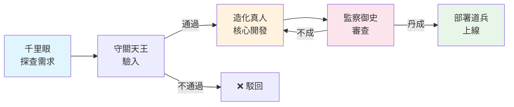

# 道法符籙 ── Claude Code Agent Prompt Generator

> 道士書符以敕令天兵；開發者撰 prompt 以驅動 agent。
> 一道符水，一紙敕令，萬法歸宗。

## 道法術語對照

道教以「道生一，一生二，二生三，三生萬物」為宇宙觀；Agent 系統亦然——從一個需求生出架構，從架構生出分工，從分工生出萬千執行。本 skill 以道教科儀體系映射 agent 開發：

| 道法體系 | 正式術語 | 說明 |
|---------|---------|------|
| 道兵 / 神將 | Agent | 被符籙敕令賦予任務的 Claude Code 實例 |
| 法師 / 高功 | Orchestrator / User | 主持科儀、調度神將之人 |
| 敕令 / 召將 | Spawn / Create | 以符咒啟動一位神將 |
| 符籙 | System Prompt / Instructions | 寫有口訣與指令的核心文本，道兵之行為契約 |
| 禁制 | Scope & Constraints | 封印道兵能力邊界的戒律 |
| 法力 | Token Budget / Resources | 可調用的計算資源，猶如修士丹田中的真氣 |
| 科儀 / 醮典 | Workflow / Pipeline | 多位神將依序行法的完整儀軌 |
| 法號 | Agent ID / Role Name | 道兵的職司封號，明確其天命所歸 |
| 壇場 | Working Directory | 道兵作業的空間，各壇互不干擾 |
| 法器 | Tools | 道兵可使用的 bash commands、API、檔案操作 |
| 功德簿 | Output / Log | 道兵完成任務後呈報的結果與記錄 |
| 天劫 | Error / Failure | 執行中遭遇的異常與失敗 |
| 渡劫 | Error Handling | 面對天劫時的應對之策 |

## 何時開壇

- 使用者想為 Claude Code 寫 agent prompt
- 使用者想設計 multi-agent 工作流
- 使用者想產生 CLAUDE.md 檔案
- 使用者想把複雜任務拆成多個 sub-agent
- 使用者說「敕令」「召將」「開壇」「書符」或任何 agent 相關需求

## 開壇行法 ── 符籙生成流程

### 第一步：明法號、定天命

凡書符籙，必先知其名、明其職。在生成 prompt 前，確認（若對話中已有，直接提取）：

1. **法號**（Role）：此道兵封號為何？司掌何職？
2. **天命**（Mission）：受敕令要完成什麼具體功業？
3. **禁制**（Constraints）：哪些是不可觸碰的戒律？可使用哪些法器？
4. **供奉/回向**（I/O）：接收什麼供物（輸入），回向什麼功德（輸出）？
5. **壇位**（Workflow Position）：獨壇行法還是在大醮中與其他神將協作？上下壇是誰？
6. **道行**（Complexity）：任務需要幾重天的道行？需要多少自主判斷？

使用者若已把需求闡明，不必反覆叩問——直接入壇書符。

### 第二步：選符籙法本

根據道兵類型，選用對應的符籙結構。讀取 `talismans.md` 取得完整法本。

六大神將：

- **獨行道兵**（Solo Agent）：獨自行法，一符了事
- **千里眼**（Scout Agent）：探路先鋒，掌管偵察、搜尋、情報收集
- **造化真人**（Builder Agent）：負責創造——寫程式碼、生成檔案、構建系統
- **監察御史**（Reviewer Agent）：鐵面無私，負責審查、測試、品質把關
- **都天大法主**（Orchestrator Agent）：坐鎮中壇，調度群將，不親自動手
- **護法天王**（Guardian Agent）：鎮守壇場，監控異常，防衛邊界

### 第三步：書符敕令（生成 Prompt）

書符之道，講究「字字有靈，句句有法」。生成的 prompt 須遵循以下符法：

#### 符籙結構——六爻格式

取自《易經》六爻之理，每道符籙分六層：

1. **初爻：宣法號、明天命**——開頭一句話說清角色與目標，如符頭朱砂點睛
2. **二爻：列法器、定權柄**——明列可用的 bash commands、file operations、API
3. **三爻：佈科儀、定步驟**——用 numbered steps 或 decision tree 描述行法程序
4. **四爻：刻回向、定功德**——精確定義產出物的格式與存放之所
5. **五爻：設渡劫、備後路**——遇天劫時的應對策略
6. **上爻：判功成、知圓滿**——什麼條件算功德圓滿

#### 書符心法

- **用敕令口吻**（祈使句）：「讀取檔案」而非「你應該讀取檔案」——符籙是命令，不是建議
- **實指勝於虛言**：「在 /src 目錄下找到所有 .py 檔案」而非「找到相關檔案」——符咒最忌含糊
- **禁制重於賦能**：明確寫「不要修改 /config 下的檔案」比「小心處理設定檔」靈驗十倍
- **案例是最好的引經據典**：附上 input/output 範例，如同符籙上的畫訣
- **符文適中**：保持 prompt 在 300-800 tokens——太短如殘符無力，太長如亂咒反噬

#### 三種符籙形制

**甲、鎮壇符格式**（適用於專案級 CLAUDE.md）
```markdown
# 壇場設定

## 法號
[角色定義]

## 敕令
[核心指令]

## 科儀
[工作流程]

## 禁制
[限制條件]

## 功德簿
[輸出規範]
```

**乙、飛符格式**（適用於 `claude -p` 即時呼叫）
生成一段可直接貼進 `claude -p "..."` 的 prompt 字串。一次性任務，用完即化。

**丙、大醮科儀格式**（適用於 multi-agent workflow）
生成多位神將的符籙 + 科儀排班：
- 各神將的獨立符籙
- 行法次第 / 觸發條件
- 壇場之間的法物（資料）傳遞
- 匯功 / 迴向邏輯

### 第四步：附護法增益（Optional Enhancements）

根據需要，為符籙加持：

- **自省訣**：讓道兵完成後自行驗證功德——「完成後重讀你的輸出，確認格式正確」
- **通報訣**：讓道兵回報行法進度——每完成一壇回報一次
- **化劫訣**：當部分法器不可用時的降級策略
- **靜心訣**：在關鍵決策點加入「先在 thinking 中推演，再行動」的提示

## 範例：一道完整的敕令

**法師說：**「幫我敕令一位道兵，把所有 Python 2 程式碼升級到 Python 3。」

**書成符籙：**

```
你是一位精通 Python 遷移之術的造化真人。

天命：將指定壇場（目錄）下所有 .py 法典從 Python 2 升格為 Python 3。

科儀：
1. 先行探查——執行 `find /src -name "*.py" -type f` 取得所有法典清冊
2. 驗明正身——對每份法典執行 `python -c "import ast; ast.parse(open('FILE').read())"` 確認是有效 Python
3. 推演變化——使用 `2to3 --no-diffs FILE` 查看需要轉化的項目
4. 施法轉化——逐一修正以下常見法障：
   - print 語句 → print() 函式
   - unicode/str 處理
   - dict.keys()/values()/items() 回傳型別
   - except Exception, e → except Exception as e
   - relative imports
5. 驗證功果——修改後執行 `python3 -c "import ast; ast.parse(open('FILE').read())"` 確認語法無誤
6. 通過試煉——若專案有測試，執行 `python3 -m pytest` 確認未破壞原有功德

禁制：
- 不得觸碰 /vendor 或 /third_party 下的外來法典
- 不得銷毀任何法典，只做原地轉化
- 遇無法自動轉化之處，留下 # TODO: manual migration needed 作為標記

功德簿：
- 圓滿後列出所有轉化過的法典清冊
- 回報任何需要法師親自介入之處
- 回報試煉結果（若有測試）
```

## 第四點五步：符籙驗證（自動觸發）

書符完成後，自動依 `linting.md` 的驗符法度檢查符籙品質。天劫級檢查未過者須修正後方可出壇。詳見 `linting.md`。

## 第四點七五步：法力估算

根據 `estimation.md` 的估算法門，為符籙附上預估的 token 消耗。包含符籙本身法力與道兵執行法力。

口訣速記：
```
一符三百起，八百為上限。
一兵兩千始，十萬為大業。
並行不省力，只省趕路時。
迭代翻倍算，三轉乘以三。
模型看道行，殺雞莫用牛。
```

---

## 問診模式 ── 互動式科儀推薦

當使用者只說「我想做 X」但未明確需要幾位神將、哪種科儀時，啟動問診模式。透過最少的問題推薦最適合的科儀組合。

### 問診科儀（最多四問，能推斷則跳過）

**第一問：法事性質**
> 你要做的事，最接近哪一種？
> 1. 探查情報（搜尋、分析、整理）
> 2. 造化創物（生成程式碼、檔案、系統）
> 3. 審查把關（Code review、安全掃描、品質檢查）
> 4. 以上皆有 / 不確定

**第二問：有無先後？**（若第一問答 4）
> 這些事情之間：
> 1. 有明確順序（先 A 再 B 再 C）→ 步罡踏斗
> 2. 可以同時做（各自獨立）→ 五雷正法
> 3. 要反覆精煉（做完檢查、不好再改）→ 九轉金丹
> 4. 混合的 → 巢狀科儀

**第三問：風險高嗎？**
> 這件事：
> 1. 隨便搞都行（本地開發、可隨時 revert）→ 無需輪值
> 2. 有點風險（會改到共用程式碼）→ 建議加守關法
> 3. 非常危險（碰生產環境、對外發送）→ 必加輪值道兵

**第四問：品質要求？**
> 1. 能用就好 → 單次行法
> 2. 要有一定品質 → 加監察御史
> 3. 精益求精 → 九轉金丹

### 問診結果

根據回答，輸出：

```
📋 問診結論：
- 推薦科儀：[科儀名]
- 神將編制：[列出需要的神將]
- 預估法力：[token 估算]
- 建議形制：[飛符 / 鎮壇符 / 大醮]

是否按此方案開壇書符？
```

若使用者的需求從對話中已可推斷答案，跳過已知的問題，直接給出推薦。能不問就不問。

---

## 科儀圖譜 ── Workflow Visualization

為生成的科儀自動繪製拓撲圖，讓使用者一眼看清壇位關係。

### ASCII 圖譜（預設）

對所有多 agent 科儀自動生成 ASCII 拓撲圖：

```
範例：步罡踏斗 + 守關法

[千里眼] ──→ [守關天王·驗入] ──→ [造化真人] ──→ [守關天王·驗出] ──→ [部署道兵]
  探查需求       驗證輸入          核心開發          驗證產出          部署上線
```

```
範例：五雷正法

                    ┌──→ [翻譯仙·中文] ──→┐
[備料道兵] ────→   ├──→ [翻譯仙·日文] ──→┤  ────→ [匯總真人]
                    └──→ [翻譯仙·韓文] ──→┘
```

### Mermaid 圖譜（進階）

當使用者要求更精美的圖譜，或科儀較複雜時，生成 Mermaid 語法：



### 圖譜生成規則

1. **每個壇位一個節點**——標注法號與職司
2. **箭頭標注法物**——節點間的箭頭上寫傳遞的資料
3. **分支標注條件**——守關法的通過/不通過、九轉金丹的成/不成
4. **輪值關口標注 ⏸️**——提醒這裡會暫停等法師
5. **替身道兵用虛線**——表示降級路徑

---

## 符籙庫 ── 現成符籙速取

常見任務不必從頭書符。讀取 `library.md` 取得預製符籙：

- **重構真人**：程式碼重構
- **試煉仙官**：測試生成
- **通譯仙人**：文件翻譯
- **移山真人**：資料庫遷移
- **開門真人**：API 端點新增
- **天機真人**：CI/CD 修繕
- **降魔護法**：安全掃描

使用者說「有沒有現成的」或任務匹配上述類型時，從符籙庫取用。

---

## 進階：醮典科儀設計

當需要多位神將協壇行法時，參考 `rituals.md` 了解六大基礎科儀陣式。

六大基礎科儀：
1. **步罡踏斗**（Pipeline）：依序行法
2. **五雷正法**（Fan-out / Fan-in）：多路並行
3. **九轉金丹**（Iterative Refinement）：反覆精煉
4. **守關法**（Gatekeeper）：關卡驗證
5. **三清會議**（Expert Panel）：多角度評估
6. **天地人三才**（Layered Architecture）：分層管理

### 進階科儀

參考 `advanced-rituals.md` 了解進階法門：
- **巢狀科儀**：科儀中套科儀，大醮套小醮
- **輪值道兵**：行法中暫停等法師確認，適用高風險操作
- **替身道兵**：主將渡劫失敗時自動降級到備用策略

### 法器對接

參考 `integrations.md` 了解如何整合外部系統：
- **MCP 法器**：Slack、GitHub、Database 等 MCP server 的符籙寫法
- **Agent SDK 科儀**：用 Python/TypeScript SDK 程式化編排科儀
- **Hooks 連動**：自動試煉、禁制守護、收壇通報等 hooks 配置

科儀根本大法：
- 每位神將只司一職（各有天命，不可僭越）
- 神將之間以壇場法物（檔案系統）傳遞信息，不可直接通靈
- 都天大法主只調度不動手，統而不作
- 設計時預想天劫：某位神將渡劫失敗時，整場科儀如何繼續
- **道法自然**——能用一位神將解決的，不要動用三位；簡單即是大道
